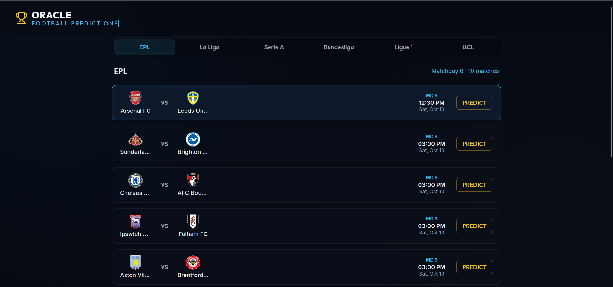
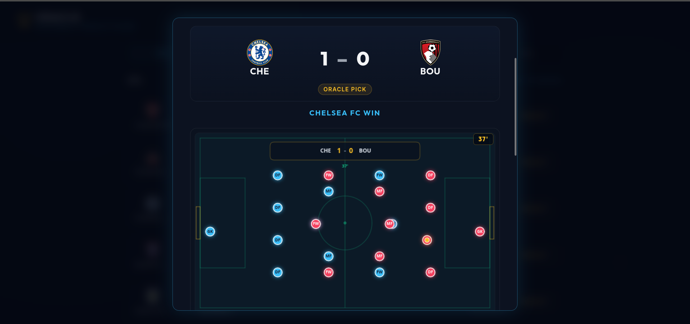

# Oracle Football Predictions

A football prediction app for the major European leagues. Pick a match from the current matchday, hit **Predict**, and the Oracle runs a Poisson simulation tuned by AI tactical analysis — with a projected timeline, a witty recap, and an animated pitch replay of how the match plays out.

You don't submit anything. The app predicts; you watch.





## How it works

1. **Pick a league** — EPL, La Liga, Serie A, Bundesliga, Ligue 1, or UCL. Each tab shows only the current/next matchday, never future rounds.
2. **Pick a match** — fixture cards show crests, kickoff time, and matchday.
3. **Predict** — the Oracle simulates the match:
   - **Poisson engine** (`@wco/shared`) draws the score from historical attack/defense ratings.
   - **Gemini AI** (optional) adds tactical modifiers: home advantage, form, injuries, style matchup — plus a one-paragraph analysis.
   - You get the predicted score, verdict (win/draw/loss), projected goal timeline, event-by-event breakdown, and a recap.
4. **Watch the replay** — a canvas pitch animation plays the projected 90 minutes in ~15 seconds, pausing on goals and big chances, with live score and minute.

Nothing is stored. Reload and run it again — you may get a different result.

## Stack

| Layer | Tech |
|---|---|
| Monorepo | npm workspaces: `@wco/shared`, `wcp-api`, `wcp-web` |
| Backend | Express 4 + TypeScript (strict), Drizzle ORM + SQLite, helmet / CORS allowlist / rate limiting, Poisson engine, Google Gemini |
| Frontend | React 19 + Vite + TypeScript, HTML5 canvas match animation, ESLint |
| Shared | Domain types, Poisson math, scoring/simulation rules |
| Data | [football-data.org](https://www.football-data.org) fixture sync |

## Quick start

```bash
npm install               # install all workspaces
```

Create `backend/.env` (see `backend/.env.example`):

```
PORT=3001
GEMINI_API_KEY=your_google_ai_key        # optional — AI commentary falls back to neutral
FOOTBALL_DATA_API_KEY=your_fd_org_token  # optional — without it, sync stays off
CORS_ORIGIN=http://localhost:5173
```

Run everything:

```bash
npm run dev
```

- Web: http://localhost:5173
- API health: http://localhost:3001/health

The database (`backend/data/app.db`) is created and seeded on first boot; migrations run automatically.

## API

| Method | Endpoint | Description |
|---|---|---|
| `GET` | `/api/competitions` | The 6 supported competitions |
| `GET` | `/api/fixtures?competition=PL&window=upcoming&limit=50` | Fixtures; `upcoming` returns only the current matchday (next stage for cups) |
| `POST` | `/api/fixtures/:id/predict` | Run the Oracle on a fixture — score, timeline, tactical analysis, AI recap. Nothing stored. |

Example:

```bash
curl -X POST http://localhost:3001/api/fixtures/123/predict
```

## Scripts

| Where | Script | Purpose |
|---|---|---|
| root | `npm run dev` | API + web concurrently |
| root | `npm test` | shared + backend test suites (49 tests) |
| backend | `npm run sync:once` | one-shot fixture sync into SQLite |
| backend | `npm run db:generate` | generate a Drizzle migration after schema changes |
| wcp-web | `npm run lint` | ESLint |
| wcp-web | `npm run build` | type-check + production build |

## Data & attribution

Live fixtures and results come from [football-data.org](https://www.football-data.org) (free tier, attribution required). The adapter caches and spaces requests for the 10 calls/min limit. Without an API key the app still runs — sync is simply disabled and you keep whatever is already in the database.

Team crests are the property of their respective clubs, fetched via football-data.org.

## License

MIT — see [LICENSE](LICENSE).
